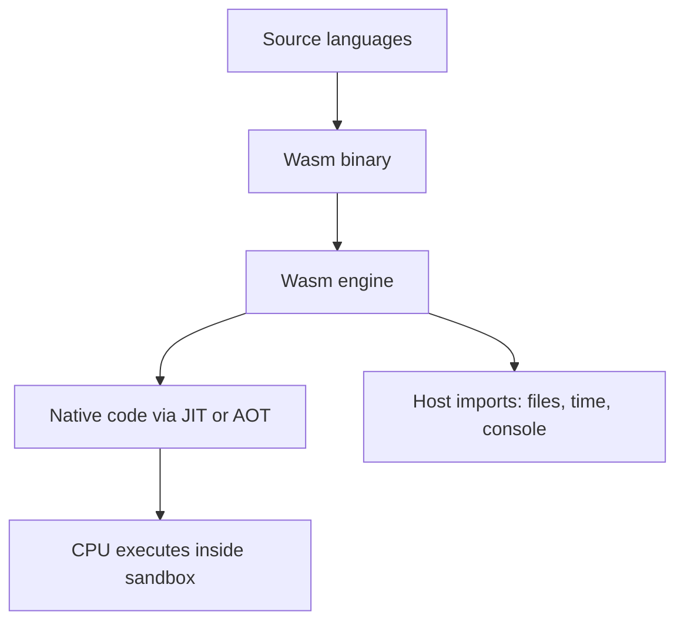
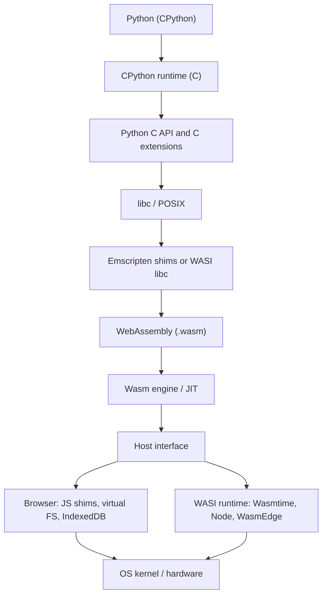
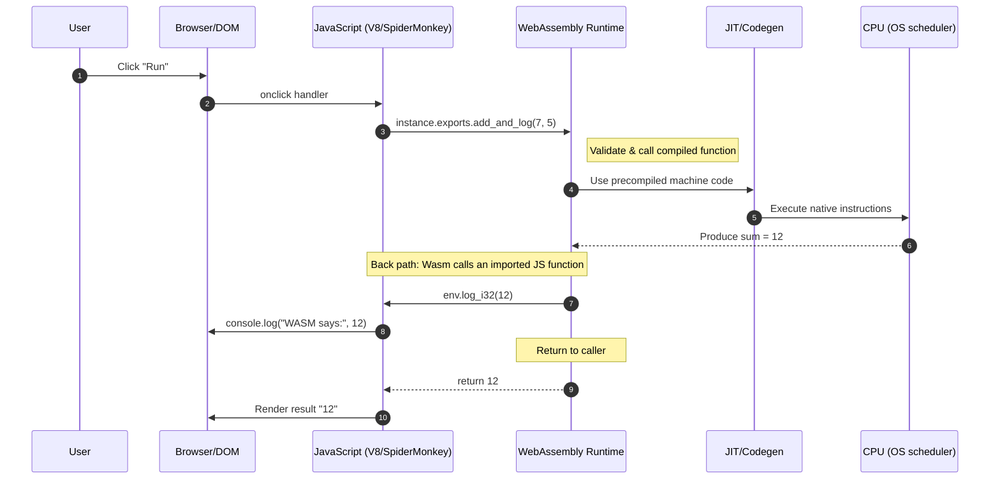
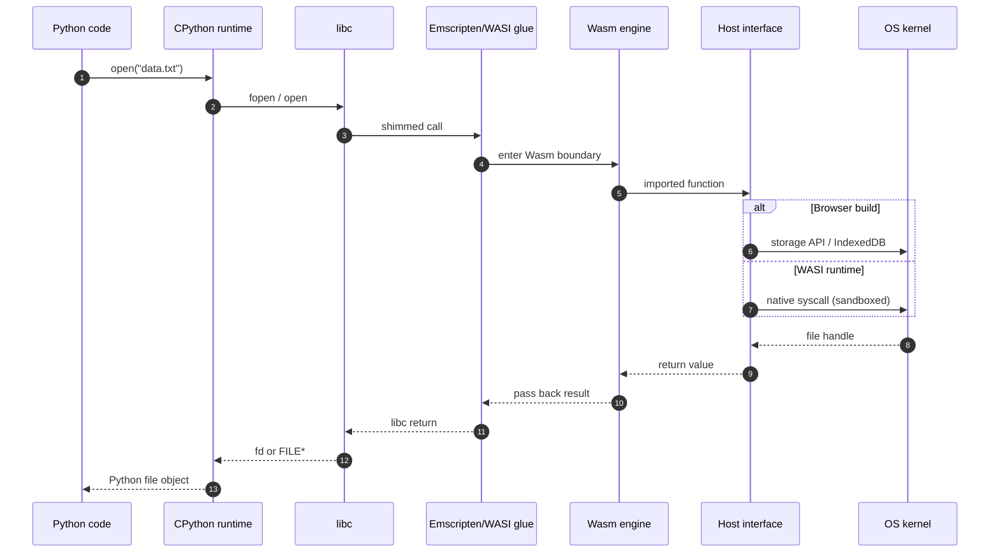

# Running LLM Code on the Web: Wasm/Pyodide, Part I

This repo is Part I of a 3-part series on running LLM-generated code on the web. Here we focus on Wasm fundamentals and two minimal browser demos. Use the Install & Run section below for setup and running.

## Series roadmap

- **Part I (this repo)**: Wasm basics + minimal JS ↔ Wasm demos
- **Part II**: Pyodide in the browser + Node/Express integration for running Python (LLM-generated) safely and interactively
- **Part III**: Hardening and shipping - packaging strategies, caching, performance tips, and end-to-end workflows

## Motivation and real‑world use cases

Across drivers, fleet operators, and OEMs, the analytics questions are often concrete and time‑sensitive. An LLM can draft the exact snippet needed, but the loop only works if we can execute that code instantly, securely, and—ideally—without installing anything. Representative asks include:

- Relating terrain to behavior: quantify how elevation ties to typical cruising speeds on segments or trips (e.g., correlations between altitude and mean speed per window).
- Detecting steering events: repair gaps in heading/compass signals (forward-fill), compute absolute changes between samples, and flag sharp turns using a high‑percentile cutoff (top decile; roughly “bigger than about 45°”).
- Understanding fleet usage: produce rollups of route coverage and driver behavior, alongside environmental context; include distribution plots and summary statistics for key metrics.
- Verifying control targets: compute the fraction of time a measured signal (like fuel rail pressure) strays outside a narrow tolerance band around its setpoint (for example, beyond ±5%).
- Checking wheel speed consistency: for each trip, assess variability across the four wheel sensors and report the maximum standard deviation observed.

Why this drives the execution model:
- The LLM supplies bespoke data‑science code on the fly; users expect near‑instant runs and quick iterations on prompts/visuals.
- Data should remain local when possible, and execution must be sandboxed with tight capability control.
- Running inside the browser via Pyodide/Wasm delivers zero‑install, portable, privacy‑preserving compute; heavier jobs can fall back to the same codepaths under Node/WASI.

## Why run LLM-generated Data Science code in the browser (Pyodide/Wasm)?

- **Zero install friction**: users open a link and run code. No Conda, no system Python, no native compilers.
- **Strong sandboxing by default**: browser/Wasm isolates execution. No file system or network unless you explicitly allow it.
- **Privacy by design**: sensitive data can stay on-device; small and medium workloads execute locally without uploading datasets.
- **Reproducibility that travels**: ship a pinned package set (micropip) and deterministic init code so notebooks and snippets behave the same on macOS/Windows/Linux.
- **Cost and scale**: shift interactive compute to the client; reserve servers for heavy jobs or collaboration.
- **Great UX for iteration**: fast edit-run loops, rich visualizations in-canvas/DOM, and JS ↔ Python data flow for UI controls.
- **Portability**: the exact same experience across devices and OSes, including managed desktops where installs are restricted.
- **Governance-friendly**: narrow, capability-based access makes security reviews simpler than desktop installs.
- **Works offline/edge**: after assets are cached, keep running even with spotty connectivity.

## Know the limits

- Heavy native dependencies (C-extensions) may not be available as pure-Python wheels; design around them or offload to a service.
- Memory/CPU are bounded by the browser; long-running or big-data jobs still belong on a backend.

## Wasm/Pyodide vs. Docker‑per‑run (why/why not)

When executing LLM‑generated code, two common approaches are: spin up a container per run (Docker/Kubernetes), or run in a Wasm/Pyodide sandbox (browser or Node/WASI). Each has a place:

When Wasm/Pyodide shines
- Zero‑install, instant start: load once in the browser; subsequent runs feel immediate. No image pulls, no cold‑start penalties.
- Strong sandbox by default: no implicit file/network access; capability‑based imports keep blast radius small.
- Privacy & offline: compute stays on the user’s device; cached assets keep working with spotty connectivity.
- Elastic cost: push interactive/visual work to clients; reserve servers/containers for heavy batch jobs.
- Portability: identical behavior across OSes and managed desktops without custom IT images.

When Docker‑per‑run is the right tool
- Heavy native stacks: large C/C++/CUDA dependencies not available for the web yet (or GPU required).
- Long/parallel jobs: workloads that exceed browser memory/CPU budgets or require multi‑process orchestration.
- Regulated data access: controlled access to internal networks, secrets, or specific storage mounts.
- Non‑web IO: direct filesystem, specialized drivers, or protocols not exposed in browsers.

Hybrid guidance
- Use the browser (Wasm/Pyodide) for rapid iteration, small/medium datasets, and interactive plots/UI.
- Mirror the same code paths under Node/WASI for server‑side replays, scheduled jobs, and larger data.
- Fall back to Docker/K8s for heavyweight or specialized scenarios; treat the Wasm path as a fast preview and the container path as the production escalator.

Operational contrasts
- Startup latency: Wasm cache + HTTP CDN vs. pulling container images; Wasm is typically faster for first‑mile UX.
- Isolation model: capability‑based sandbox (Wasm) vs. namespace/cgroup isolation (containers). Both are strong; threat models differ.
- Observability: browser logs/telemetry via JS, artifacts via virtual FS; containers integrate with existing infra (logs/metrics/tracing/registries).
- Supply chain: ship static web assets for Wasm vs. manage image registries and SBOMs for containers; both need provenance.

Bottom line: start in the browser for speed, safety, and user experience; escalate to containers when physics or dependencies demand it.

## Plots and interactive visualization in the browser

Many analytics flows culminate in figures, dashboards, or exploratory widgets. Running code where the UI lives unlocks:

- Native interactivity: libraries like Plotly, Vega‑Lite, and ECharts render directly in the DOM/WebGL with hover, zoom, selection, and linked brushing.
- Low‑latency updates: recompute in Pyodide → update JS/Plotly traces instantly; great for prompt‑iterate cycles.
- Zero‑copy UI integration: pass TypedArrays and JSON between Python and JS without server round‑trips.
- Offline/edge visualization: keep insights usable even without a network connection.

Notes
- Matplotlib/Seaborn can render to canvas/SVG; for rich interactivity, prefer web‑native libraries (Plotly, Vega, ECharts) or use mpl‑to‑plotly adapters when needed.
- For server‑side rendering, you can still generate static PNG/SVG in Node/WASI and stream to clients, but you’ll lose the fluid, client‑side interactions.

## Automation and Server Mode (Node.js)

- **Programmatic execution**: have an LLM generate Python, send it to a REST endpoint, execute in a controlled Pyodide runtime, and return results as JSON (stdout/stderr, figures, data frames serialized).
- **Simple API shape**: POST /execute { code, inputs } to run; GET /runs/:id to fetch status/artifacts; optional SSE/WebSocket for live logs/streams.
- **Run on Node.js to bypass browser limits**: execute the same Pyodide code under Node (server-side) when you need more memory/CPU, headless batch jobs, or trusted network/file access.
- **Leverage the Node ecosystem**: authentication (JWT/OAuth), authorization/RBAC, rate limiting, CSRF, routing/middleware, logging/metrics, retries/timeouts, job queues, and caching.
- **Persist outputs and ensure traceability**: mount Pyodide's virtual FS to persistent storage (IndexedDB in the browser; host disk in Node) to save Matplotlib/Seaborn plots, logs, and intermediate files. Store code + inputs + outputs together for reproducibility/auditing.

## Why WebAssembly Matters

WebAssembly powers production applications like:
- **Figma** – Design tool performance comparable to native apps
- **AutoCAD Web** – Full CAD software running in browsers
- **Google Earth** – 3D globe rendering at 60fps
- **Photoshop Web** – Complex image processing in the browser
- **Unity Games** – Console-quality games without plugins

## Foundations

### What WebAssembly is
WebAssembly (Wasm) is a **portable, sandboxed, low-level binary format**. It lets you run compiled code (C/C++/Rust/Zig, etc.) safely in:
- **Browsers** (integrated with the JavaScript engine)
- **Servers/CLIs** via runtimes (Node's `node:wasi`, Wasmtime, Wasmer, WasmEdge)

Think of it as **"LLVM-like bytecode for the web and beyond"** with strict safety guarantees and predictable performance characteristics.

### Why people use it
- **Performance**: Ahead-of-time or JIT compiled to native CPU instructions.
- **Portability**: Same `.wasm` can run across OSes/CPUs when a runtime exists.
- **Safety**: Memory-safe, capability-based host access (you only get what's imported).

### How execution works (high level)



* **Imports/Exports**: Wasm modules **export** functions and **import** host functions (JS in browsers; WASI or custom hosts in runtimes).
* **Memory model**: A linear memory (resizable array of bytes). JS can view it as `ArrayBuffer`; native code uses pointers/offsets.
* **Sandbox**: No raw syscalls; all host access is explicitly imported.

### Emscripten vs. WASI — What They Are and When to Use Them

#### What is **Emscripten**?

* **Definition**: A compiler toolchain (built on LLVM/Clang) that takes C/C++ (and anything that compiles to LLVM IR) and outputs WebAssembly plus a layer of JavaScript "glue code."
* **How it works**:
  * Replaces the C standard library (`libc`) calls with **JavaScript shims** (virtual filesystem, sockets via WebSockets, stdout → browser console).
  * Lets legacy codebases believe they are running on a POSIX-like OS, even though they're inside a browser sandbox.
* **Use cases**: Porting large C/C++ projects to the web (e.g., CPython → Pyodide, SDL games, OpenCV in browser, NumPy).
* **Mental model**: *Fake a Unix-like OS in the browser by redirecting syscalls through JavaScript.*

#### What is **WASI (WebAssembly System Interface)**?

* **Definition**: A standardized set of system calls for WebAssembly outside the browser.
* **How it works**:
  * Defines a portable API (`wasi_snapshot_preview1`) for files, directories, clocks, randomness, args/env, etc.
  * Runtimes (like Wasmtime, Node's `node:wasi`, Wasmer, WasmEdge) implement those APIs and forward them safely to the host OS.
* **Use cases**: Headless/server-side Wasm programs, CLI tools, micro-VMs at the edge, lightweight container replacements.
* **Mental model**: *Give Wasm modules a minimal, standardized "operating system" that works across all runtimes.*

#### Comparison — When to Choose Each

| Aspect             | **Emscripten**                              | **WASI**                                     |
| ------------------ | ------------------------------------------- | -------------------------------------------- |
| Primary target     | **Browsers** (integrated with JS/DOM)       | **Servers / CLIs / Edge runtimes**           |
| System calls       | Shimmed through **JavaScript**              | Standardized **portable syscalls**           |
| Filesystem         | Virtual FS, IndexedDB, in-memory            | Real host directories (sandboxed pre-opens)  |
| Networking         | WebSockets, XHR (emulated sockets)          | Host TCP/UDP (if runtime implements)         |
| Typical toolchains | `emcc` (Emscripten compiler)                | Clang, Rust, Zig targeting `wasm32-wasi`     |
| Best for…          | Bringing **existing C/C++ code** to the web | Writing **new headless/server apps** in Wasm |

**One-liner takeaway:**
* Use **Emscripten** when you want Wasm in the **browser** and need JS shims for POSIX-style code.
* Use **WASI** when you want Wasm on the **server/edge** with a clean, portable syscall layer.

### Browser vs. Node (mental model)

* **Browser path**: JS/DOM ↔ Wasm. You pass imports from JS; Wasm calls them. Files/sockets are emulated or backed by browser storage/APIs.
* **Node/WASI path**: Host provides WASI imports; module starts like a tiny process with sandboxed pre-opened directories and a minimal syscall surface.

### Feature notes (quick)

* **SIMD**: Widely supported in modern engines for data-parallel speedups.
* **Threads**: In browsers, requires cross-origin isolation (COOP/COEP). In WASI runtimes, depends on host support.
* **Exceptions, reference types, GC**: Advancing steadily; check engine/runtime versions.

### Typical toolchains

* **C/C++**: Emscripten (`emcc`) for browser; Clang + WASI sysroot for WASI.
* **Rust**: Targets `wasm32-unknown-unknown` (browser) or `wasm32-wasi` (WASI). Tooling: `wasm-bindgen`, `wasm-pack`.
* **Zig/Clang**: Direct to `wasm32-wasi` for minimalist builds.

### Mini-FAQ

* **"Is Wasm tied to one CPU?"** No. Engines JIT/AOT to your CPU (x86-64, ARM64, etc.). The same `.wasm` runs where an engine exists.
* **"Can Python run in Wasm?"** Yes. Via Emscripten (Pyodide) or emerging WASI targets. Many POSIX calls are emulated in-browser.
* **"Do I need JS?"** In browsers, yes (for orchestration/imports). In Node/WASI, you can be fully headless.

## Architecture

### OS Illusion Stack

High-level runtimes think they run atop an OS. In the browser, Emscripten provides JS shims and a virtual filesystem; in servers, WASI-capable runtimes expose a minimal, portable syscall layer.



Key takeaways:
- Browser path: libc calls funnel into JS glue (Emscripten) and browser APIs; no raw syscalls.
- WASI path: libc targets WASI; the runtime mediates access to real OS resources via sandboxed pre-opens.

### JS ↔ Wasm ↔ JS Round Trip

Why this matters for LLM‑generated code: in this repo, the primary host is Node.js. Host JS (Node) orchestrates execution, captures logs/metrics, and persists artifacts; Wasm is the fast, sandboxed compute box. The “round trip” is the contract between them. Host JS initiates work (passing inputs, buffers, and callbacks) → Wasm computes (compiled C/C++ or Python via Emscripten/Pyodide) → Wasm calls back into JS for logging, progress, or access to safe capabilities you expose → and finally returns results for storage or response serialization. The same pattern also works in the browser when you want a client‑side experience.

How it connects to the bigger picture (Node focus):
- Orchestration: Node owns routing, auth, rate limits, queues, and where results are stored; Wasm focuses on deterministic compute. LLM‑generated code plugs into this loop without owning the server.
- Safety and governance: the only powers Wasm gets are the JS imports you provide (capability‑based). This enables precise guardrails and auditability in server environments.
- Streaming outputs: prints/logs/progress flow back via JS callbacks; stream them over SSE/WebSockets, or write to durable logs.
- Data movement: pass Node Buffers/TypedArrays (zero‑copy where possible) to keep throughput high; keep sensitive data on trusted hosts.
- Browser parity (optional): the same contract works in the browser for interactive sandboxes and demos.

Tiny Node host for the minimal demo (imports a single log function and calls the exported add_and_log):

```javascript
// node >= 18
import { readFile } from 'node:fs/promises';

const bytes = await readFile('minimal-demo/dist/add_and_log.wasm');
const imports = { env: { log_i32: (x) => console.log('WASM says:', x) } };
const { instance } = await WebAssembly.instantiate(bytes, imports);

const result = instance.exports.add_and_log(7, 5);
console.log('Result:', result);
```

The minimal demo is intentionally tiny: `add_and_log` computes a sum (Wasm) and calls `env.log_i32` (JS) to prove the back‑path works. In Pyodide‑based flows, `print()`/exceptions/plots take the same path and can be streamed to clients or persisted for audit.

This diagram shows how JavaScript calls WebAssembly, which can call back into JavaScript, and return values:



### Syscall Round Trip Sequence

Why this matters for LLM‑generated code: “syscalls” define what code can actually do. On servers (our focus), you either:
- run Emscripten‑style modules with explicit JS imports (as in this repo’s demos), or
- target WASI (`wasm32-wasi`) and run them under a WASI host (e.g., Node’s `node:wasi`, Wasmtime), where you pre‑open directories and selectively enable clocks, randomness, args/env, and networking.

Either way, you grant LLM‑authored code only the minimum capabilities—nothing more—keeping execution portable and auditable. In the browser (optional), Emscripten emulates POSIX‑like calls via safe JS shims (virtual FS, console, timers) so code “feels” the same without touching real disks or sockets.

Bigger picture connections (Node/WASI):
- Capability gating: the host decides which imports exist. No import ⟹ no power. Strong guardrails for production.
- Reproducibility and audit: pre‑opened dirs and explicit imports make inputs/outputs traceable; snapshot code+data+artifacts alongside logs.
- Security by default: there are no raw syscalls from Wasm; everything is brokered by JS or a WASI runtime.
- Environment parity: keep the same “open/print” semantics in dev and prod across Node and WASI; add browser builds when you want a client demo.

How a single `open()` flows from user code down to the host and back:



Notes:
- In browsers, the "OS" is emulated via JS; persistence often uses IndexedDB or in-memory FS.
- In WASI, access is explicit and limited; directories must be pre-opened by the host.

---

# Install & Run (Quickstart)

This guide has two parts:
- Quickstart to build and run the demos (with a local server).
- Emscripten SDK (concise) pointers and gotchas (see below).

---

## Quickstart: run the demos (Browser or Node)

Prerequisites:
- Emscripten SDK installed and environment loaded so `emcc` is on PATH (see below if needed)
- A local static file server (browsers block `fetch` from `file://`)
- Optional (Node path): Node.js 18+ for running the minimal demo directly under Node

Start a static server from the repo root (pick one):
- Python: `python -m http.server 8000` (or `py -m http.server 8000` on Windows)
- Node: `npx serve .`
- VS Code: Live Server extension

1) Minimal JS ↔ Wasm demo
- Build the Wasm once:
  - PowerShell: `minimal-demo/scripts/build_add_and_log.ps1`
  - Bash: `minimal-demo/scripts/build_add_and_log.sh`
- Open: `http://localhost:8000/minimal-demo/index.html`
- Click "Run". You should see console log "WASM says: 12" and on-page "Result: 12".

  Optional: run the minimal demo under Node (no browser)
  - After building, run this with Node ≥ 18 from repo root:
    ```javascript
    // save as run-node.mjs (example)
    import { readFile } from 'node:fs/promises';
    const bytes = await readFile('minimal-demo/dist/add_and_log.wasm');
    const imports = { env: { log_i32: (x) => console.log('WASM says:', x) } };
    const { instance } = await WebAssembly.instantiate(bytes, imports);
    console.log('Result:', instance.exports.add_and_log(7, 5));
    ```
    Then: `node run-node.mjs`

2) Emscripten Starter Pack demo
- Build:
  - PowerShell: `emscripten-starter-pack/scripts/build.ps1`
  - Bash: `emscripten-starter-pack/scripts/build.sh`
- Open: `http://localhost:8000/emscripten-starter-pack/web/index.html`

Troubleshooting:
- If you open via `file://`, you'll see CORS errors like "CORS request not http". Always use `http://localhost`.
- In DevTools Network tab, ensure `.wasm` files return 200 and paths match the HTML.

- Note: Both demos will fall back from `WebAssembly.instantiateStreaming(...)` to a non-streaming path if your server doesn't set the `application/wasm` MIME type.
- Windows PowerShell: If script execution is blocked, either run the command with `-ExecutionPolicy Bypass -File <script.ps1>` or set `Set-ExecutionPolicy -Scope Process Bypass` for the current session.

---

# Installing the Emscripten SDK (emsdk)

The Emscripten SDK provides all the tools required to compile C/C++ to WebAssembly (`.wasm`). It bundles `clang`, `node`, `python`, and utilities like `emcc`.

Prerequisites: Git, Python 3, and ~2GB disk space.

---

## Linux/macOS

```bash
# Clone and setup
git clone https://github.com/emscripten-core/emsdk.git
cd emsdk
./emsdk install latest
./emsdk activate latest

# Load environment (each new shell)
source ./emsdk_env.sh

# Verify
emcc -v
```

To make permanent, add `source $HOME/emsdk/emsdk_env.sh` to `~/.bashrc` or `~/.zshrc`.

## Windows (PowerShell)

```powershell
# Clone and setup
git clone https://github.com/emscripten-core/emsdk.git
cd emsdk
.\emsdk install latest
.\emsdk activate latest

# Load environment (each new shell)
.\emsdk_env.ps1

# Verify
emcc -v
```

To make permanent, run `.\emsdk.ps1 activate latest --system` with Admin privileges.

---

## Common Issues

| Issue | Fix |
|-------|-----|
| `emcc: command not found` | Run `source ./emsdk_env.sh` (Linux) or `.\emsdk_env.ps1` (Windows) |
| Download stuck | Check firewall/proxy settings for GitHub access |
| "Permission denied" (Linux) | Run `chmod +x emsdk` |

---

## Test Installation

```bash
# Build a sample
emcc emscripten-starter-pack/c/hello_stdio.c -o test.html

# Serve and view
python -m http.server 8000
# Open: http://localhost:8000/test.html
```

---

## References

* [Emscripten docs](https://emscripten.org/docs/getting_started/downloads.html)
* [emsdk GitHub](https://github.com/emscripten-core/emsdk)

---

# Demos

## What's Available
- **Minimal demo**: build `minimal-demo/dist/add_and_log.wasm` with `minimal-demo/scripts/build_add_and_log.ps1` (or `.sh`), then open `minimal-demo/index.html` via a local server
- **Emscripten pack demo**: run `emscripten-starter-pack/scripts/build.*` and open `emscripten-starter-pack/web/index.html`

## Repository Layout
```
./
├─ minimal-demo/
│  ├─ c/
│  │  └─ add_and_log.c            # tiny C function that calls back into JS
│  ├─ dist/                        # created by build; contains add_and_log.wasm
│  ├─ index.html                   # loads dist/add_and_log.wasm
│  └─ scripts/
│     ├─ build_add_and_log.ps1
│     └─ build_add_and_log.sh
├─ emscripten-starter-pack/
│  ├─ c/                           # Emscripten samples (hello_stdio.c, hello_export.c)
│  ├─ scripts/                     # build/clean scripts (.ps1/.sh)
│  └─ web/index.html               # loads ../dist/hello_export.wasm
├─ README.md
└─ LICENSE
```
