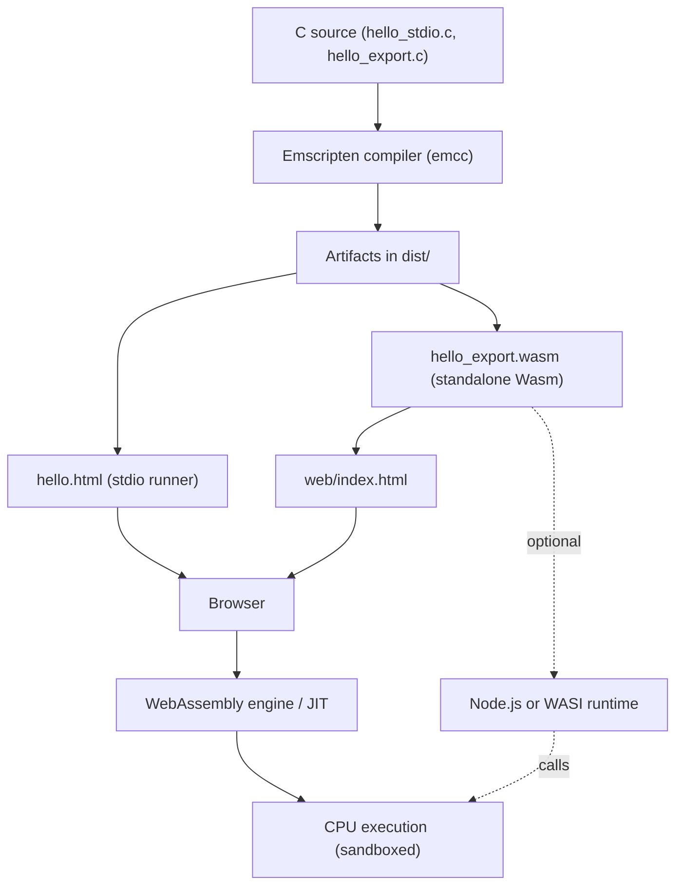

# Emscripten Starter Pack

This repository contains a **complete starter environment** for learning and teaching how to compile C programs into **WebAssembly** using the [Emscripten SDK](https://emscripten.org/).

It is designed for students in a lecture/lab setting. Everything needed is provided: C source code, build scripts, HTML scaffolding, and detailed installation instructions.

---

## 📦 Contents

* **`INSTALL.md`** — step-by-step guide for installing the Emscripten SDK on **Ubuntu** and **Windows**.
* **`README.md`** — this document.
* **`c/hello_stdio.c`** — a simple C program using `printf`, compiled into a WebAssembly module with HTML wrapper.
* **`c/hello_export.c`** — a C program that exports a pure function `add(int, int)` to be called directly from JavaScript.
* **`web/index.html`** — minimal webpage that loads `hello_export.wasm` and calls the exported function.
* **`scripts/build.sh`** — Bash build script (Linux/macOS).
* **`scripts/build.ps1`** — PowerShell build script (Windows).
* **`dist/`** — output folder for build artifacts (`.html`, `.wasm`).

---

## 🚀 Quick Start

### 1. Install the SDK

Follow [INSTALL.md](./INSTALL.md) carefully for your platform (Ubuntu or Windows).
Verify installation with:

```bash
emcc -v
```

---

### 2. Build the Examples

#### On Linux/macOS

```bash
source ~/emsdk/emsdk_env.sh
bash scripts/build.sh
```

#### On Windows (PowerShell)

```powershell
.\path\to\emsdk\emsdk_env.ps1
powershell -ExecutionPolicy Bypass -File scripts\build.ps1
```

> ⚠️ If `emcc` is not found, make sure you’ve sourced `emsdk_env.sh` (Linux/macOS) or run `emsdk_env.ps1` (Windows).

---

### 3. Run in a Browser

Serve the repo root with a simple HTTP server:

```bash
python3 -m http.server 8080
```

Open your browser at:

* [`http://localhost:8080/dist/hello.html`](http://localhost:8080/dist/hello.html)
  → Shows **“Hello, WebAssembly!”** in the browser console.

* [`http://localhost:8080/web/index.html`](http://localhost:8080/web/index.html)
  → Loads `hello_export.wasm` and computes `_add(7,5) = 12`.

---

## 🧪 What You’ll Learn

* How **Emscripten** compiles C to WebAssembly.
* Difference between:

  * **stdio programs** (`printf` → compiled HTML runner).
  * **pure functions** exported from C and called directly from JS.
* The role of **emsdk environment scripts** (`emsdk_env.sh` / `emsdk_env.ps1`).
* Basics of loading and calling Wasm modules in modern browsers.

---

## 🛠️ Troubleshooting

| Symptom                       | Cause                                 | Fix                                                                               |
| ----------------------------- | ------------------------------------- | --------------------------------------------------------------------------------- |
| `emcc: command not found`     | Environment not loaded                | Run `source ./emsdk_env.sh` or `.\emsdk_env.ps1`                                  |
| Browser shows blank page      | Accessing file:// instead of http\:// | Always use an HTTP server (e.g., `python3 -m http.server`)                        |
| Import error for `_add`       | Wrong build flags                     | Re-run provided build script                                                      |
| SSL/Proxy issues cloning repo | Git cannot reach GitHub               | Configure `git config --global http.sslBackend schannel` (Windows) or check proxy |

---

## 📚 References

* [Emscripten Documentation](https://emscripten.org/docs/getting_started/index.html)
* [WebAssembly.org](https://webassembly.org/)
* [emsdk GitHub Repo](https://github.com/emscripten-core/emsdk)

---

## 🎓 Teaching Tip

When running this in class:

1. Show what happens when `emcc` is missing (`command not found`).
2. Source the environment script, rerun, and show it works.
3. Let students compare the **generated HTML runner** (`hello.html`) with the **standalone wasm** loaded in `index.html`.

This reinforces why Emscripten’s environment setup matters and highlights two common workflows.

## Reference Diagram




