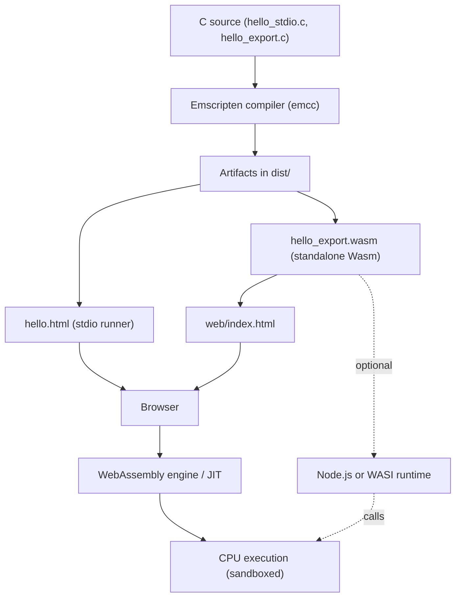

# Emscripten Starter Pack

This folder contains a starter environment for compiling C to WebAssembly using the Emscripten SDK. It’s designed for lecture/lab: C sources, build scripts, and a minimal web page are included.

## Contents
- Emscripten SDK install: see repo root README (Emscripten SDK concise) or official docs
- c/hello_stdio.c - printf demo (generates HTML runner)
- c/hello_export.c - pure function demo (exports `_add`)
- web/index.html - loads `dist/hello_export.wasm` and calls `_add`
- scripts/build.sh - Bash build script
- scripts/build.ps1 - PowerShell build script
- dist/ - output folder for build artifacts

## Quick Start
1) Install the SDK
- Follow INSTALL.md for your OS, then verify with `emcc -v`

2) Build the examples
- Linux/macOS:
  - `source ~/emsdk/emsdk_env.sh`
  - `bash scripts/build.sh`
- Windows (PowerShell):
  - `.\path\to\emsdk\emsdk_env.ps1`
  - `powershell -ExecutionPolicy Bypass -File scripts\build.ps1`

> If `emcc` is not found, make sure you loaded the emsdk env script.

3) Run in a browser
- Serve the repo root: `python3 -m http.server 8080`
- Open:
 - http://localhost:8080/emscripten-starter-pack/dist/hello.html
  - http://localhost:8080/emscripten-starter-pack/web/index.html

## What You'll Learn
- How Emscripten compiles C to WebAssembly
- Difference between stdio runners and pure exported functions
- Role of `emsdk_env.sh` / `emsdk_env.ps1`
- Basics of loading Wasm in the browser

## Generated Artifacts vs Source Files
- Generated (do not commit):
  - `dist/hello.html`, `dist/hello.js`, `dist/hello.wasm` (from `hello_stdio.c`)
  - `dist/hello_export.wasm` (from `hello_export.c`)
- Source (keep in repo):
  - Everything under `c/` and `scripts/`
  - `web/index.html` (hand-written page that fetches from `../dist/`)

Note: If you see files like `web/hello_stdio.html`, `web/hello_stdio.js`, or `web/hello_stdio.wasm`, they were likely generated and accidentally placed/committed under `web/`. This starter expects build outputs in `dist/` only. You can safely remove those from `web/`.

## Why `hello_export.c` here, but no extra export file in the top-level demo?
- Starter pack: `c/hello_export.c` is a minimal example focused on exporting a pure function. The build uses `-s EXPORTED_FUNCTIONS=_add` so the wasm exports `_add`, which `web/index.html` then calls.
- Top-level demo: the export comes directly from the same source file (`web/c/add_and_log.c`) using a linker flag in the build script: `-Wl,--export=add_and_log` (with `-s STANDALONE_WASM=1` and `--no-entry`). There’s no separate “export-only” file because the goal is to show a tiny, glue-free JS ↔ Wasm round-trip.

## Troubleshooting
- `emcc: command not found`: load the env script
- Blank page: don’t use file:// — run an HTTP server
- Import error for `_add`: re-run the provided build script
- SSL/Proxy issues: configure Git (`http.sslBackend schannel` on Windows) or proxy

## Reference Diagram

