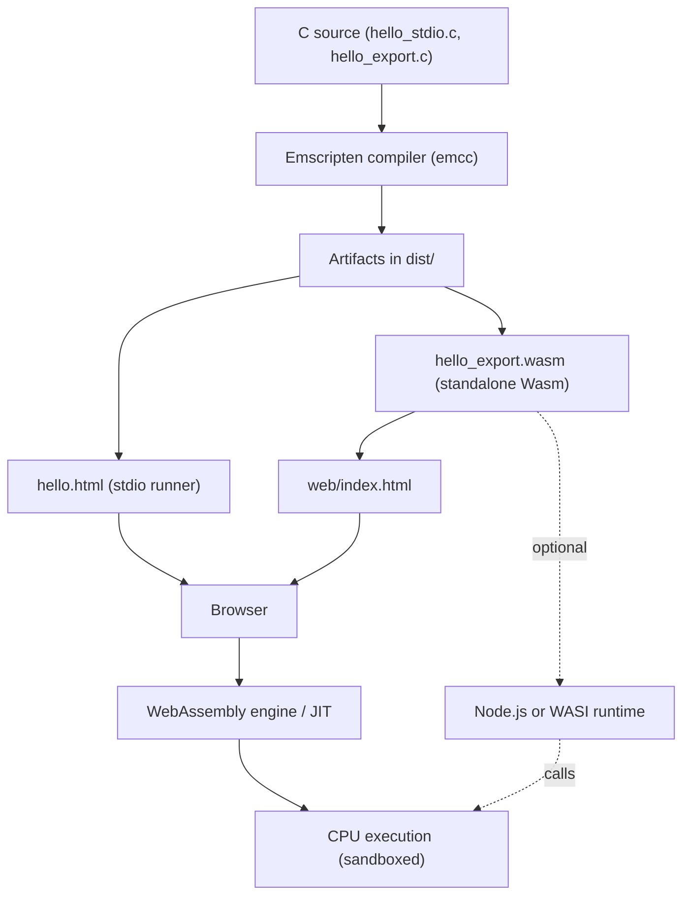

# Emscripten Starter Pack

This folder contains a starter environment for compiling C to WebAssembly using the Emscripten SDK. It’s designed for lecture/lab: C sources, build scripts, and a minimal web page are included.

## Contents
- INSTALL.md – Emscripten SDK install for Ubuntu and Windows
- c/hello_stdio.c – printf demo (generates HTML runner)
- c/hello_export.c – pure function demo (exports `_add`)
- web/index.html – loads `dist/hello_export.wasm` and calls `_add`
- scripts/build.sh – Bash build script
- scripts/build.ps1 – PowerShell build script
- dist/ – output folder for build artifacts

## Quick Start
1) Install the SDK
- Follow INSTALL.md for your OS, then verify with `emcc -v`

2) Build the examples
- Linux/macOS:
  - `source ~/emsdk/emsdk_env.sh`
  - `bash scripts/build.sh`
- Windows (PowerShell):
  - `.\path\to\emsdk\emsdk_env.ps1`
  - `powershell -ExecutionPolicy Bypass -File scripts\build.ps1`

> If `emcc` is not found, make sure you loaded the emsdk env script.

3) Run in a browser
- Serve the repo root: `python3 -m http.server 8080`
- Open:
  - http://localhost:8080/emscripten-starter-pack/dist/hello.html
  - http://localhost:8080/emscripten-starter-pack/web/index.html

## What You'll Learn
- How Emscripten compiles C to WebAssembly
- Difference between stdio runners and pure exported functions
- Role of `emsdk_env.sh` / `emsdk_env.ps1`
- Basics of loading Wasm in the browser

## Troubleshooting
- `emcc: command not found`: load the env script
- Blank page: don’t use file:// — run an HTTP server
- Import error for `_add`: re-run the provided build script
- SSL/Proxy issues: configure Git (`http.sslBackend schannel` on Windows) or proxy

## Reference Diagram

