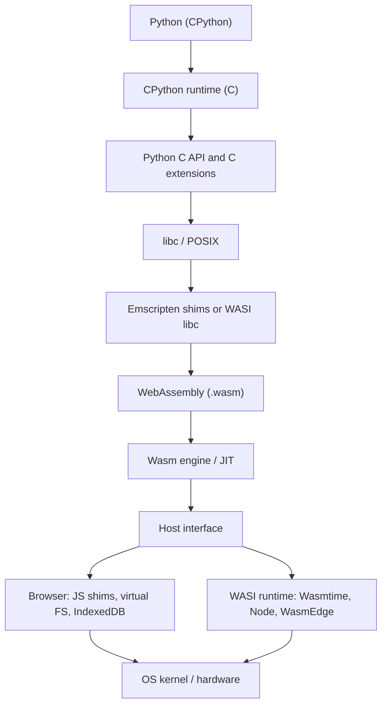

```mermaid
graph TD
  A["Python (CPython)"] --> B["CPython runtime (C)"]
  B --> C["Python C API and C extensions"]
  C --> D["libc / POSIX"]
  D --> E["Emscripten shims or WASI libc"]
  E --> F["WebAssembly (.wasm)"]
  F --> G["Wasm engine / JIT"]
  G --> H["Host interface"]
  H --> I["Browser: JS shims, virtual FS, IndexedDB"]
  H --> J["WASI runtime: Wasmtime, Node, WasmEdge"]
  I --> K["OS kernel / hardware"]
  J --> K["OS kernel / hardware"]
```

