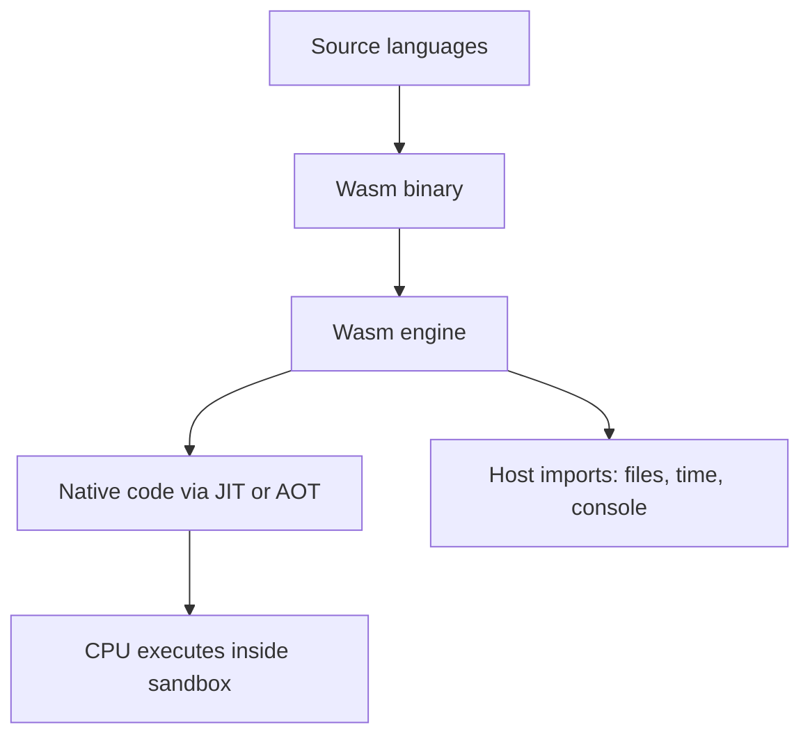

# Introduction to WebAssembly (Wasm)

## What it is
WebAssembly (Wasm) is a **portable, sandboxed, low-level binary format**. It lets you run compiled code (C/C++/Rust/Zig, etc.) safely in:
- **Browsers** (integrated with the JavaScript engine)
- **Servers/CLIs** via runtimes (Node’s `node:wasi`, Wasmtime, Wasmer, WasmEdge)

Think of it as **“LLVM-like bytecode for the web and beyond”** with strict safety guarantees and predictable performance characteristics.

## Why people use it
- **Performance**: Ahead-of-time or JIT compiled to native CPU instructions.
- **Portability**: Same `.wasm` can run across OSes/CPUs when a runtime exists.
- **Safety**: Memory-safe, capability-based host access (you only get what’s imported).

## How execution works (high level)

* **Imports/Exports**: Wasm modules **export** functions and **import** host functions (JS in browsers; WASI or custom hosts in runtimes).
* **Memory model**: A linear memory (resizable array of bytes). JS can view it as `ArrayBuffer`; native code uses pointers/offsets.
* **Sandbox**: No raw syscalls; all host access is explicitly imported.

## Emscripten vs. WASI (which to choose?)

* **Emscripten**: Best for **browser** targets and ecosystems that assume POSIX APIs (CPython, NumPy, SDL).

  * Provides **libc shims**: files (virtual FS/IndexedDB), sockets (WebSockets), stdout/console bridges.
  * Pairs well with front-end UIs and JS interop.
* **WASI**: Best for **server/CLI** style modules where you want portable syscalls (files, clocks, random, args, env) without browser-specific shims.

  * Works great with Node’s `node:wasi`, Wasmtime, etc.
  * Cleaner model for headless compute and edge runtimes.

## Browser vs. Node (mental model)

* **Browser path**: JS/DOM ↔ Wasm. You pass imports from JS; Wasm calls them. Files/sockets are emulated or backed by browser storage/APIs.
* **Node/WASI path**: Host provides WASI imports; module starts like a tiny process with sandboxed pre-opened directories and a minimal syscall surface.

## Feature notes (quick)

* **SIMD**: Widely supported in modern engines for data-parallel speedups.
* **Threads**: In browsers, requires cross-origin isolation (COOP/COEP). In WASI runtimes, depends on host support.
* **Exceptions, reference types, GC**: Advancing steadily; check engine/runtime versions.

## Typical toolchains

* **C/C++**: Emscripten (`emcc`) for browser; Clang + WASI sysroot for WASI.
* **Rust**: Targets `wasm32-unknown-unknown` (browser) or `wasm32-wasi` (WASI). Tooling: `wasm-bindgen`, `wasm-pack`.
* **Zig/Clang**: Direct to `wasm32-wasi` for minimalist builds.

## Debugging & profiling (starter tips)

* Enable source maps where possible.
* In browsers: use DevTools (Performance tab) + console logging via imports.
* In Node/WASI: print to stdout/stderr, use runtime flags for tracing.

## Where this repo fits

1. Read this intro.
2. Skim the **illusion stack** to understand how high-level runtimes (e.g., Python) “believe” they have an OS.

   * See: [illusion.md](./illusion.md)
3. Study the **round-trip flow** (JS → Wasm → JS import → return).

   * See: [round\_trip\_flow.md](./round_trip_flow.md)
4. Review a **syscall’s journey** across boundaries.

   * See: [syscall\_roundtrip.md](./syscall_roundtrip.md)
5. Follow [INSTALL.md](./INSTALL.md) and run `index.html`.

## Mini-FAQ

* **“Is Wasm tied to one CPU?”** No. Engines JIT/AOT to your CPU (x86-64, ARM64, etc.). The same `.wasm` runs where an engine exists.
* **“Can Python run in Wasm?”** Yes. Via Emscripten (Pyodide) or emerging WASI targets. Many POSIX calls are emulated in-browser.
* **“Do I need JS?”** In browsers, yes (for orchestration/imports). In Node/WASI, you can be fully headless.

---

**Next:** head back to the [README roadmap](./README.md) and pick your path (browser demo or Node/WASI).

