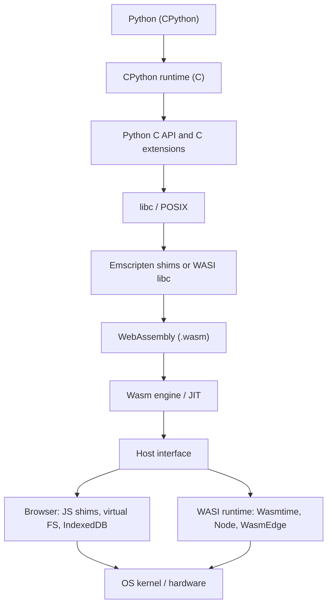
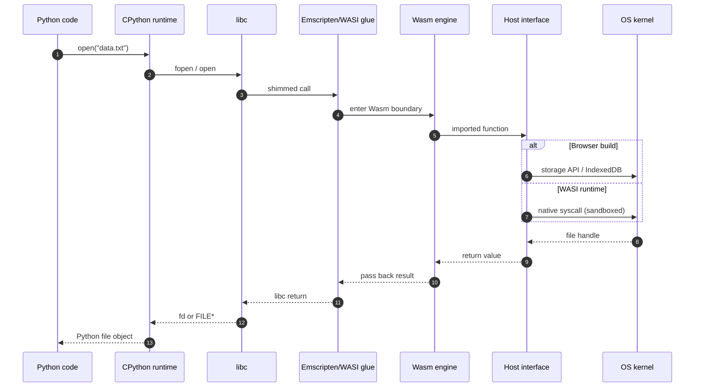

# Introduction to WebAssembly (Wasm)

## What it is
WebAssembly (Wasm) is a **portable, sandboxed, low-level binary format**. It lets you run compiled code (C/C++/Rust/Zig, etc.) safely in:
- **Browsers** (integrated with the JavaScript engine)
- **Servers/CLIs** via runtimes (Node’s `node:wasi`, Wasmtime, Wasmer, WasmEdge)

Think of it as **“LLVM-like bytecode for the web and beyond”** with strict safety guarantees and predictable performance characteristics.

## Why people use it
- **Performance**: Ahead-of-time or JIT compiled to native CPU instructions.
- **Portability**: Same `.wasm` can run across OSes/CPUs when a runtime exists.
- **Safety**: Memory-safe, capability-based host access (you only get what’s imported).

## How execution works (high level)

* **Imports/Exports**: Wasm modules **export** functions and **import** host functions (JS in browsers; WASI or custom hosts in runtimes).
* **Memory model**: A linear memory (resizable array of bytes). JS can view it as `ArrayBuffer`; native code uses pointers/offsets.
* **Sandbox**: No raw syscalls; all host access is explicitly imported.

---

## Emscripten vs. WASI — What They Are and When to Use Them

### What is **Emscripten**?

* **Definition**: A compiler toolchain (built on LLVM/Clang) that takes C/C++ (and anything that compiles to LLVM IR) and outputs WebAssembly plus a layer of JavaScript “glue code.”
* **How it works**:

  * Replaces the C standard library (`libc`) calls with **JavaScript shims** (virtual filesystem, sockets via WebSockets, stdout -> browser console).
  * Lets legacy codebases believe they are running on a POSIX-like OS, even though they’re inside a browser sandbox.
* **Use cases**: Porting large C/C++ projects to the web (e.g., CPython -> Pyodide, SDL games, OpenCV in browser, NumPy).
* **Mental model**: *Fake a Unix-like OS in the browser by redirecting syscalls through JavaScript.*

---

### What is **WASI (WebAssembly System Interface)**?

* **Definition**: A standardized set of system calls for WebAssembly outside the browser.
* **How it works**:

  * Defines a portable API (`wasi_snapshot_preview1`) for files, directories, clocks, randomness, args/env, etc.
  * Runtimes (like Wasmtime, Node’s `node:wasi`, Wasmer, WasmEdge) implement those APIs and forward them safely to the host OS.
* **Use cases**: Headless/server-side Wasm programs, CLI tools, micro-VMs at the edge, lightweight container replacements.
* **Mental model**: *Give Wasm modules a minimal, standardized “operating system” that works across all runtimes.*

---

### Comparison — When to Choose Each

| Aspect             | **Emscripten**                              | **WASI**                                     |
| ------------------ | ------------------------------------------- | -------------------------------------------- |
| Primary target     | **Browsers** (integrated with JS/DOM)       | **Servers / CLIs / Edge runtimes**           |
| System calls       | Shimmed through **JavaScript**              | Standardized **portable syscalls**           |
| Filesystem         | Virtual FS, IndexedDB, in-memory            | Real host directories (sandboxed pre-opens)  |
| Networking         | WebSockets, XHR (emulated sockets)          | Host TCP/UDP (if runtime implements)         |
| Typical toolchains | `emcc` (Emscripten compiler)                | Clang, Rust, Zig targeting `wasm32-wasi`     |
| Best for…          | Bringing **existing C/C++ code** to the web | Writing **new headless/server apps** in Wasm |

---

**One-liner takeaway:**

* Use **Emscripten** when you want Wasm in the **browser** and need JS shims for POSIX-style code.
* Use **WASI** when you want Wasm on the **server/edge** with a clean, portable syscall layer.

## Browser vs. Node (mental model)

* **Browser path**: JS/DOM <-> Wasm. You pass imports from JS; Wasm calls them. Files/sockets are emulated or backed by browser storage/APIs.
* **Node/WASI path**: Host provides WASI imports; module starts like a tiny process with sandboxed pre-opened directories and a minimal syscall surface.

## Feature notes (quick)

* **SIMD**: Widely supported in modern engines for data-parallel speedups.
* **Threads**: In browsers, requires cross-origin isolation (COOP/COEP). In WASI runtimes, depends on host support.
* **Exceptions, reference types, GC**: Advancing steadily; check engine/runtime versions.

## Typical toolchains

* **C/C++**: Emscripten (`emcc`) for browser; Clang + WASI sysroot for WASI.
* **Rust**: Targets `wasm32-unknown-unknown` (browser) or `wasm32-wasi` (WASI). Tooling: `wasm-bindgen`, `wasm-pack`.
* **Zig/Clang**: Direct to `wasm32-wasi` for minimalist builds.

## Debugging & profiling (starter tips)

* Enable source maps where possible.
* In browsers: use DevTools (Performance tab) + console logging via imports.
* In Node/WASI: print to stdout/stderr, use runtime flags for tracing.

## Where this repo fits

1. Read this intro.
2. Skim the OS Illusion stack below to see how high-level runtimes (e.g., Python) “believe” they have an OS.
3. Study the JS–Wasm round-trip in the section below (browser flow: JS -> Wasm -> JS import -> return).
4. Review a syscall’s journey across boundaries in the Syscall Round Trip section below.
5. Follow the Install & Run section in [README](./README.md#install--run-lecture-quickstart) and run the demos.

## Mini-FAQ

* **“Is Wasm tied to one CPU?”** No. Engines JIT/AOT to your CPU (x86-64, ARM64, etc.). The same `.wasm` runs where an engine exists.
* **“Can Python run in Wasm?”** Yes. Via Emscripten (Pyodide) or emerging WASI targets. Many POSIX calls are emulated in-browser.
* **“Do I need JS?”** In browsers, yes (for orchestration/imports). In Node/WASI, you can be fully headless.

---

**Next:** head back to the [README roadmap](./README.md) and pick your path (browser demo or Node/WASI).

---

## OS Illusion (stack view)

High-level runtimes think they run atop an OS. In the browser, Emscripten provides JS shims and a virtual filesystem; in servers, WASI-capable runtimes expose a minimal, portable syscall layer.

Key takeaways:
- Browser path: libc calls funnel into JS glue (Emscripten) and browser APIs; no raw syscalls.
- WASI path: libc targets WASI; the runtime mediates access to real OS resources via sandboxed pre-opens.

---

## Syscall Round Trip (sequence)

How a single open() flows from user code down to the host and back.

Notes:
- In browsers, the “OS” is emulated via JS; persistence often uses IndexedDB or in-memory FS.
- In WASI, access is explicit and limited; directories must be pre-opened by the host.

---

## JS-Wasm Round Trip (browser)

The JS ↔ Wasm ↔ JS round trip flow is now documented in the main [README.md](./README.md#js--wasm--js-round-trip) to provide a more streamlined reading experience.

