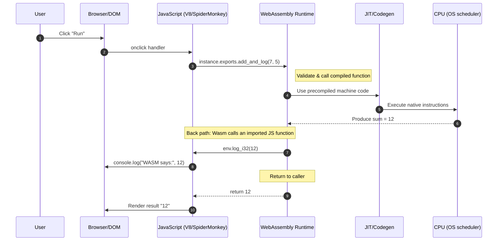

# Round Trip Flow

```mermaid
sequenceDiagram
    autonumber
    participant User as User
    participant DOM as Browser/DOM
    participant JS as JavaScript (V8/SpiderMonkey)
    participant Wasm as WebAssembly Runtime
    participant JIT as JIT/Codegen
    participant CPU as CPU (OS scheduler)

    User->>DOM: Click "Run"
    DOM->>JS: onclick handler
    JS->>Wasm: instance.exports.add_and_log(7, 5)
    Note right of Wasm: Validate & call compiled function
    Wasm->>JIT: Use precompiled machine code
    JIT->>CPU: Execute native instructions
    CPU-->>Wasm: Produce sum = 12

    Note over Wasm,JS: Back path: Wasm calls an imported JS function
    Wasm->>JS: env.log_i32(12)
    JS->>DOM: console.log("WASM says:", 12)

    Note over Wasm: Return to caller
    Wasm-->>JS: return 12
    JS->>DOM: Render result "12"
```
