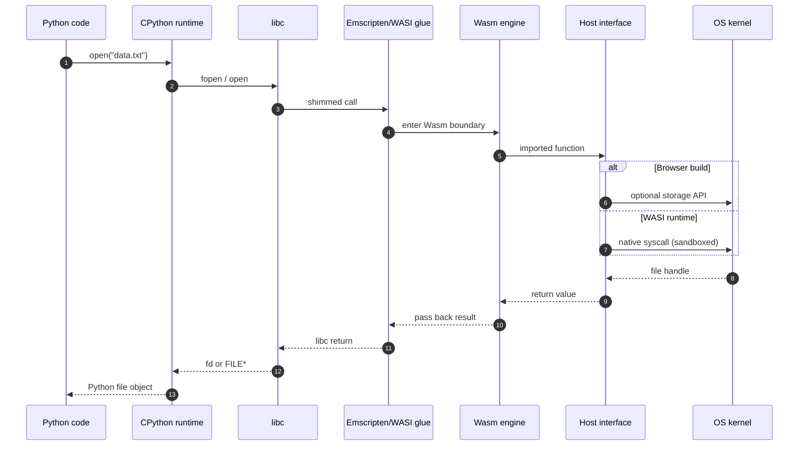

# Syscall Round Trip

```mermaid
sequenceDiagram
  autonumber
  participant Py as Python code
  participant CP as CPython runtime
  participant Libc as libc
  participant Glue as Emscripten/WASI glue
  participant Wasm as Wasm engine
  participant Host as Host interface
  participant OS as OS kernel

  Py->>CP: open("data.txt")
  CP->>Libc: fopen / open
  Libc->>Glue: shimmed call
  Glue->>Wasm: enter Wasm boundary
  Wasm->>Host: imported function
  alt Browser build
    Host->>OS: optional storage API
  else WASI runtime
    Host->>OS: native syscall (sandboxed)
  end
  OS-->>Host: file handle
  Host-->>Wasm: return value
  Wasm-->>Glue: pass back result
  Glue-->>Libc: libc return
  Libc-->>CP: fd or FILE*
  CP-->>Py: Python file object
```
